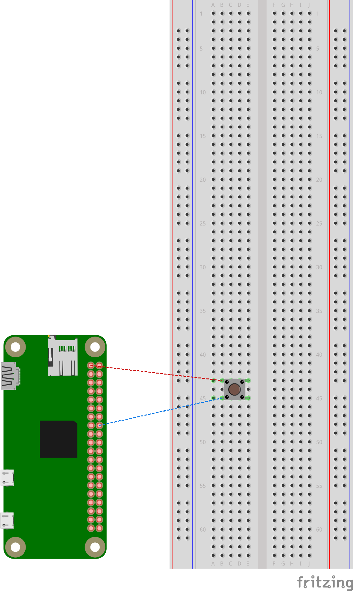

# Raspberry PI Workshop for the Freie Universitat

## Introduction

Cheap semiconductors and easy-to-use libraries allow everybody to improvise their own
low-tech solutions for their daily problems. This tutorial gives a bit of insight on
how to get started hacking with the Raspberry PI's GPIO.

For these examples you'll need python installed and a raspberry pi.

We'll implement a very simple button. What the button does is up to you. If you can
make it print something on activation, you can also make it launch the zombie killing
missiles ;)

## Login to your RPI Zero W.

1. Connect the micro-usb cable to the port labeled "USB". Make sure _NOT_ to use the
   one labeled PWD.

2. You will need Bonjour or similar in your computer. (avahi-daemon in linux)

3. Connect to the USB-Ethernet:

	- Ubuntu: In the network manager connect to the USB wired connection.
	- Go to NetworkManager, in the tab IPv4-settings set Method to `Link-Local Only`

4. Do: `ssh pi@raspberrypi.local`. Password `raspberry`

## Check that the Geeny Hub is running by calling:

`curl -H "Content-Type: application/json"\
      -X POST -d '{"email":"<your-user>","password":"<your-password>"}'\
	  http://localhost:9000/api/v1/login`

You can create a Geeny Dev account [here](https://labs.geeny.io/register/developer?next=https%3A%2F%2Fdevelopers.geeny.io%2F)

## Plugging everything together.

You will need only 2 cables and a switch button.

- The input goes to the GPIO 23 (i.e second column. 8th row. Counting from top to bottom)
- And the power (first column, first row)



### First Attempt

Open your favorite editor and copy:

```python
# We'll be using the GPIO library to
# interact with the hardware
import RPi.GPIO as GPIO

# There are different ways to "count" the pins.
# We'll use the Broadcom notation
GPIO.setmode(GPIO.BCM)

# It's a Button. Then is an IN-put. We can select if we want to activate it
# as pull-down (activated on pressed) or pull-up. (Activated on release)
GPIO.setup(23, GPIO.IN, pull_up_down=GPIO.PUD_DOWN)

try:
  while True:
	  # 23 is the pin number based on BCM we wanted.
      if GPIO.input(23):
          print("Button 1 pressed")

# Takes care of cleaning up after is done
except KeyboardInterrupt:
    print "Keyboard Interrupt: Exit"
    GPIO.cleanup()
```

Copy the program into your RPI Zero:

```bash
$ scp button.py pi@raspberrypi.local:~/
$ ssh pi@raspberrypi.local
$ python button.py
```

Press the button. What's the behaviour? Anything wrong?

### Single Event Program (First Attempt)

```python
import RPi.GPIO as GPIO

GPIO.setmode(GPIO.BCM)
GPIO.setup(23, GPIO.IN, pull_up_down=GPIO.PUD_DOWN)

try:
  while True:
      if GPIO.input(23):
          print("Button pressed")
          while True:
              if not GPIO.input(23):
                print("Button released")
                break

except KeyboardInterrupt:
    print "Keyboard Interrupt: Exit"
    GPIO.cleanup()
```

### What Happens?

There are multiple points on which the conditions are met. Specially shortly after
the switch button presses against the contact points.

[Bouncing](https://en.wikipedia.org/wiki/Switch#Contact_bounce)

## Debouncing using a sleep

Adding a simple sleep fixes the problem

```python
import RPi.GPIO as GPIO
import time

GPIO.setmode(GPIO.BCM)
GPIO.setup(23, GPIO.IN, pull_up_down=GPIO.PUD_DOWN)

def pause():
    time.sleep(0.1)

try:
  while True:
    if GPIO.input(23):
        print("Button pressed")
        while True:
            if not GPIO.input(23):
                print("Button released")
		break
    pause()

except KeyboardInterrupt:
    print "Keyboard Interrupt: Exit"
    GPIO.cleanup()
```

[The topic of switch bouncing is super interesting!](https://www.allaboutcircuits.com/technical-articles/switch-bounce-how-to-deal-with-it/)


# Appendix A. Setup USB Internet for Raspberry Pi Zero W

From
[here](https://learn.adafruit.com/turning-your-raspberry-pi-zero-into-a-usb-gadget/ethernet-gadget)

1. Burn Raspbian into the SD Card
2. Modify config.txt in the boot partition and add: `dtoverlay=dwc2`
3. Modify cmdline.txt and add `modules-load=dwc2,g_ether` after `rootwait`
4. (Optional) create a file called ssh in the boot partition (i.e `touch ssh`)

# Appendix B. Setup Rust for Cross-compilation

## Setup `cross`

```bash
curl https://sh.rustup.rs -sSf | sh
rustup component add rust-src
rustup install nightly-2017-10-25 # Use the latest version
rustup target add armv7-unknown-linux-gnueabihf
cargo install --vers 0.3.8 xargo
cargo install cross
```

## Building the API.

Clone repository `https://github.com/geeny/linux-hub-sdk.git`

```bash
cross build --bin hub-service --release --target armv7-unknown-linux-gnueabihf  --features="rest-service"
```

## Configuration:

```
cp ./geeny_hub_service.mvdb.json.example ./geeny_hub_service.mvdb.json
```

Then, modify all the paths so they point to real paths with the right permissions.

# Appendix C. API Cheatsheet

## Create Thing

```bash
curl -X POST \
    -H 'Content-Type: application/json' \
    -H 'Accept: application/json' \
    -d '{
        "name": "<name-of-your-thing>",
        "serial_number": "123",
        "thing_type": "877827cc-0c78-4e55-80fe-2941479c681a"
        }' \
    'http://localhost:9000/api/v1/things' > thing.info
```

## Send Message

```bash
curl -H "Content-Type: application/json" -X POST -d '{"msgs":[]}'
http://localhost:9000/api/v1/messages/123
```

## Get your JWT Token:

```
curl -X POST \
    -H 'Content-Type: application/json' \
    -H 'Accept: application/json' \
    -d '{
        "email": "<your-email-address>",
        "password": "<your-password>"
        }' \
    'https://connect.geeny.io/auth/login/' | jq -r '.token' > geeny.token
```
