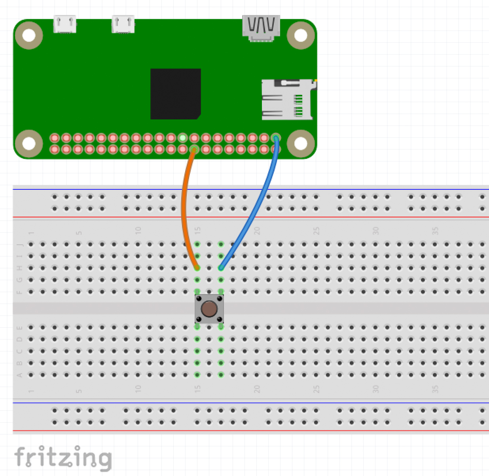

# RPI Workshop for the Freie Universitat

## Introduction

Cheap semiconductors and easy-to-use libraries allow everybody to improvise their own
low-tech solutions for their daily problems. This tutorial gives a bit of insight on
how to get started hacking with the Raspberry PI's GPIO.

For these examples you'll need python installed and a raspberry pi.

We'll implement a very simple button. What the button does is up to you. If you can
make it print something on activation, you can also make it launch the zombie killing
missiles ;)

## Step 0: SSH to your RPI Zero W.

### Requirements:

- Windows:
You might need to install an ssh client like [Putty](http://www.putty.org/)

- Linux/OSX: Open a terminal.

### Join the network

Join to the `Telefonica NEXT Guest` SSID with password "geenyguest".

Your rapberry pi zero should be pre-configured to connect to `Telefonica NEXT
Guest` and it uses Bonjour to broadcast its hostname.

Once connected you can just type:

```bash
ssh pi@geeny1.local
```

Make sure to replace the number with your Raspberry Pi number.

#### Check that the Geeny Hub is running:

You can create a Geeny Dev account
[here](https://labs.geeny.io/register/developer?next=https%3A%2F%2Fdevelopers.geeny.io%2F)

```
curl -H "Content-Type: application/json" -X POST -d '{"email":"<your-user>","password":"<your-password>"}' http://localhost:9000/api/v1/login
```

## Step 1: Plugging everything together.

You will need only 2 cables and a switch button.

- The input goes to the GPIO 23 (i.e second column. 8th row. Counting from top to bottom)
- And the power (first column, first row)

[Use this reference for details on the layout of the pinout](https://pinout.xyz/#)



## Step 2: GPIO Getting Started

Open your favorite editor and copy:

```python
# We'll be using the GPIO library to
# interact with the hardware
import RPi.GPIO as GPIO

# There are different ways to "count" the pins.
# We'll use the Broadcom notation
GPIO.setmode(GPIO.BCM)

# It's a Button. Then is an IN-put. We can select if we want to activate it
# as pull-down (activated on pressed) or pull-up. (Activated on release)
GPIO.setup(23, GPIO.IN, pull_up_down=GPIO.PUD_DOWN)

try:
  while True:
      # 23 is the pin number based on BCM we wanted.
      if GPIO.input(23):
          print("Button 1 pressed")

# Takes care of cleaning up after is done
except KeyboardInterrupt:
  pass
finally:
  print "Exit: Cleanup"
  GPIO.cleanup()
```

Test your code in the Raspberry Pi

```bash
# Copy the file
$ scp button.py pi@raspberrypi.local:~/
# Run the code:
$ ssh pi@raspberrypi.local
$ python button.py
```

Press the button. What's the behaviour? Anything wrong?

### Step 3: Fixing Debouncing

There are multiple points on which the conditions are met. Especially shortly after
the switch button presses against the contact points.

[Bouncing](https://en.wikipedia.org/wiki/Switch#Contact_bounce)

[The topic of switch bouncing is super interesting!](https://www.allaboutcircuits.com/technical-articles/switch-bounce-how-to-deal-with-it/)

One way to deal with it is to use a sleep/wait function.

```python
import RPi.GPIO as GPIO
import time

GPIO.setmode(GPIO.BCM)
GPIO.setup(23, GPIO.IN, pull_up_down=GPIO.PUD_DOWN)

try:
  while True:
    if GPIO.input(23):
        print("Button pressed")
        while True:
            if not GPIO.input(23):
                print("Button released")
		break
    time.sleep(0.1)

except KeyboardInterrupt:
  pass
finally:
  print "Exit: Cleanup"
  GPIO.cleanup()
```

## Step 4. Make it do something cool!

[From twilio's
documentation:](https://www.twilio.com/docs/api/messaging/send-messages#messaging-services)

A common solution we have seen is SMS powered emergency button for the care of the
elderly.

```python
import RPi.GPIO as GPIO
import time
import os

from twilio.rest import Client

# Your Account SID from twilio.com/console
account_sid = "<Account ID>"
# Your Auth Token from twilio.com/console
auth_token  = os.environ["TWILIO_SECRET"]

client = Client(account_sid, auth_token)

def send_alert():
  message = client.messages.create(
    to="<a registered number>",
    from_="+18312221512",
    body="Diego! RED ALERT!")
  print("Sent: ", message.sid)

GPIO.setmode(GPIO.BCM)
GPIO.setup(23, GPIO.IN, pull_up_down=GPIO.PUD_DOWN)

try:
  while True:
    if GPIO.input(23):
      while GPIO.input(23):
        pass
      send_alert()
	time.sleep(0.1)

except KeyboardInterrupt:
  pass
finally:
  print "Exit: Cleanup"
  GPIO.cleanup()
```

## Step 5. Make it Geeny Enabled!

We'll need to create a device with a serial number using the following snippet:

```bash
curl -X POST \
    -H 'Content-Type: application/json' \
    -H 'Accept: application/json' \
    -d '{
        "name": "<name-of-your-thing>",
        "serial_number": "123",
        "thing_type": "877827cc-0c78-4e55-80fe-2941479c681a"
        }' \
    'http://localhost:9000/api/v1/things' > thing.info
```

And now we can use our geeny-hub image to publish a message whenever the button is
pressed.

```python
import RPi.GPIO as GPIO
import time
import os
import requests
import json

# Fill these in.
EMAIL=""
PASSWORD=""
SERIAL_NUMBER=""

# Call the login function of the SDK. It requires a user-password.
def login():
  url = 'http://localhost:9000/api/v1/login'
  payload = json.dumps({'email': EMAIL, 'password': PASSWORD})
  headers = {'Content-Type': 'application/json'}
  response = requests.post(url, data=payload, headers=headers)
  return response.text == "success"

# A small wrapper around the publish endpoint of the SDK.
def publish():
  print("publishing message...")
  url = 'http://localhost:9000/api/v1/messages/' + SERIAL_NUMBER
  payload = json.dumps({'msgs': []})
  headers = {'Content-Type': 'application/json'}
  response = requests.post(url, data=payload, headers=headers)
  print(response.text)

def send_alert():
  publish()

def setup():
  if login():
    GPIO.setmode(GPIO.BCM)
    GPIO.setup(23, GPIO.IN, pull_up_down=GPIO.PUD_DOWN)
    print("GPIO setup done")
  else:
    raise "error in login"

def run():
  while True:
    if GPIO.input(23):
      while GPIO.input(23):
        pass
      send_alert()
    time.sleep(0.1)

try:
  setup()
  run()
except KeyboardInterrupt:
  pass
finally:
  print "Exit: Cleanup"
  GPIO.cleanup()
```
